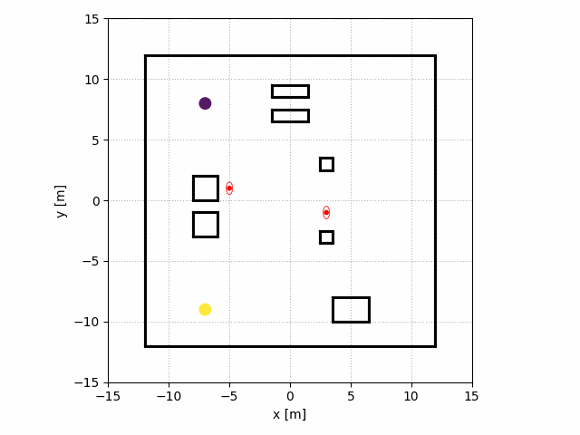
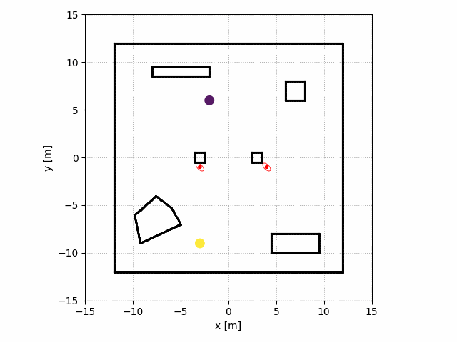
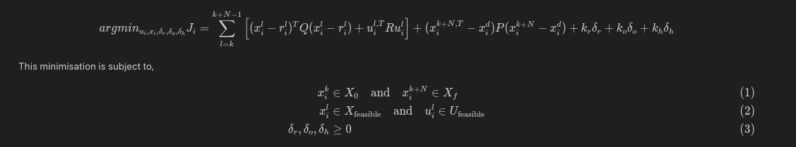
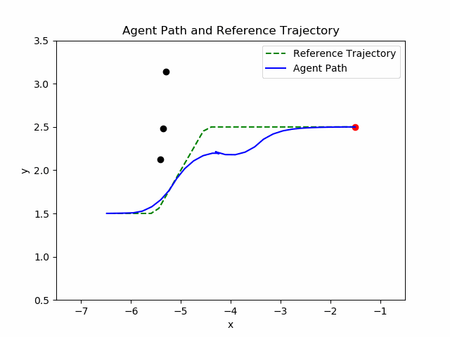
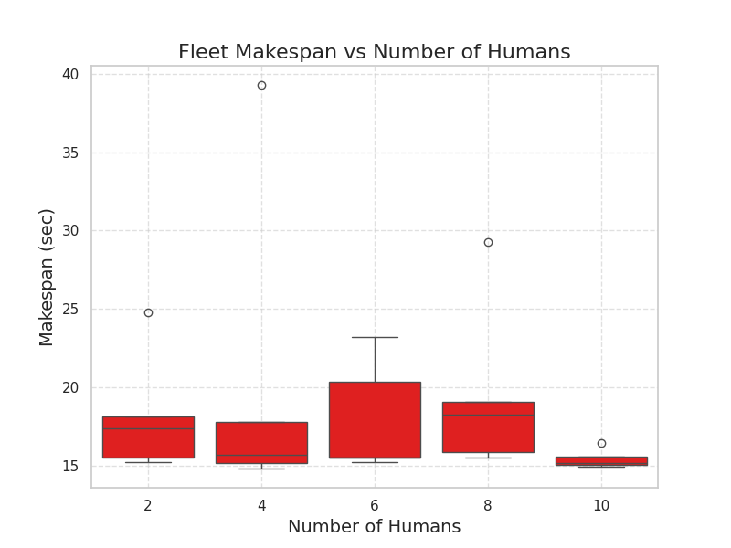
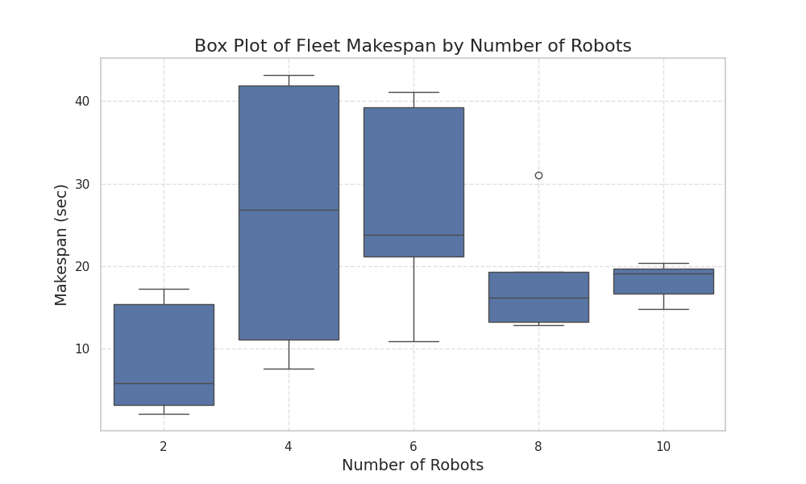

# Human Aware Multi-Robot Motion Planning

 This project proposes a **Human-aware motion planning methodology** for warehouse
settings. We introduce HAMCBS (Human-aware Model Predictive Conflict-Based Search), a
strategy to resolve human-robot conflicts alongside other obstacles. Using a model predictive
control-based planner and a social force model for human motion prediction, the CB-MPC
(Conflict-Based Model Predictive Control) algorithm generates optimal trajectories.
The methodology for this work mainly takes inspiration from on the CB-MPC model for multi-robots[[1]](http://arxiv.org/abs/2303.01619), and the social force model for human dynamics[[2]](https://www.researchgate.net/profile/Dirk-Helbing/publication/1947096_Social_Force_Model_for_Pedestrian_Dynamics/links/02bfe510e677d8de59000000/Social-Force-Model-for-Pedestrian-Dynamics.pdf).





We use an MPC formulation of the following form.



Solution illustration:



## Simulation setup
python CasaDi is used for horizon solutions in the work.

To run the implementation, please make sure you have python 3 installed.

The following package installations are necessary for non-ROS version
```
python3 -m pip install numpy
python3 -m pip install casadi
python3 -m pip install matplotlib
python3 -m pip install toml
python3 -m pip install pyyaml
python3 -m pip install opencv-python
```
The ROS version needs ROS-noetic follow the follwoing wiki to install the same:
https://wiki.ros.org/noetic/Installation/Ubuntu

You can run the random environment generation by executing:
```
python3 src/simulation_random.py
```
The ROS version has no localisation module published at the moment. Hence robot control is not implemented.
Laser scan and environment can be run after moving the src folder to **catkin_ws** in home folder
```
mkdir ~/catkin_ws
```
once **src** is copied to catkin_ws,
```
cd ~/catkin_ws
catkin_make
source ~/catkin_ws/devel/setup.bash
roslaunch simplified.lauch
```

# Experimental results
<div style="display:inline-block; margin-right: 10px">
<p>Average solving time per robot vs Prioritized MPC</p></div>
<div style="display:inline-block; margin-right: 10px">

<p>Solution time per robot vs environmental complexity</p></div>


<div style="display:inline-block; margin-right: 10px">
<p>Fleet makespan vs number of humans</p></div>
<div style="display:inline-block; margin-right: 10px">

<p>Fleet makespan vs number of robots</p></div>

Please see the [report](/Kolleth-2655154.pdf) for detailed methodology, results and discussion.

## References
[1] A. Tajbakhsh, L. T. Biegler, and A. M. Johnson, ‘Conflict-Based Model Predictive Control for Scalable Multi-Robot Motion Planning’, Apr. 01, 2024, arXiv: arXiv:2303.01619. doi: 10.48550/arXiv.2303.01619.

[2] E. Boyarski et al., ‘ICBS: improved conflict-based search algorithm for multi-agent pathfinding’, in Proceedings of the 24th International Conference on Artificial Intelligence, in IJCAI’15. Buenos Aires, Argentina: AAAI Press, Jul. 2015, pp. 740–746.

[3]D. Helbing and P. Molnár, “Social force model for pedestrian dynamics,” Physical Review E, vol. 51, no. 5, pp. 4282–4286, May 1995, doi: 10.1103/physreve.51.4282.
